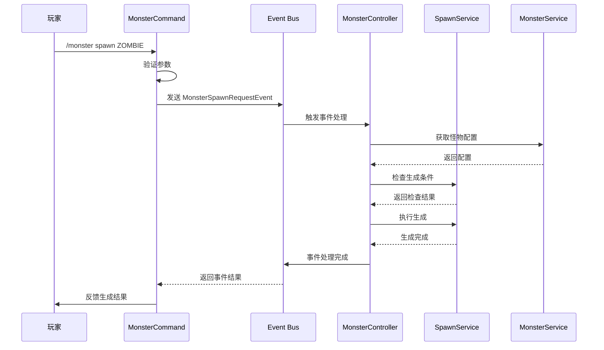
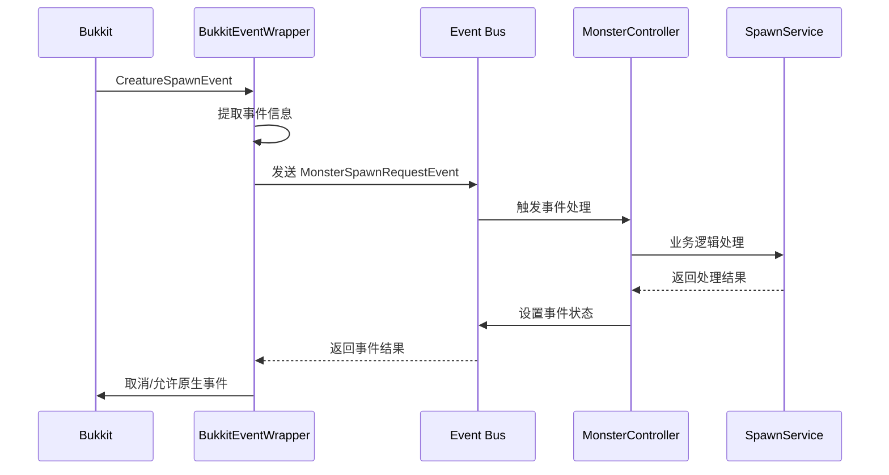

# MonsterSpawnController 怪物生成控制

## 架构设计理念

### 从 Spring Boot 到 Minecraft 插件的架构迁移

例如 Spring Boot 的 Controller 用于对外提供 HTTP 接口，如果从 Controller 本身的角度来看，它是被触发的。结合 Minecraft 插件模式，在 Minecraft 服务端中能触发 Controller 的有玩家命令、事件监听器。

那么我们就可以按照 Minecraft 的插件模式，将架构设计为：
- **触发层**：Command（命令）、Listener（事件监听器）作为插件业务的入口
- **控制层**：Controller 作为业务逻辑的调度层
- **服务层**：Service 作为业务逻辑层
- **数据层**：Manager/Repository 作为数据访问层

## 🎯 事件驱动架构设计

### 核心思想：触发解耦

通过**自定义事件**将命令触发和事件触发统一包装，Controller 只需监听自定义事件，从而实现触发源与业务逻辑的完全解耦。

### 为什么使用 Bukkit 内置事件系统？

**Bukkit/Spigot 自带的强大事件系统**：

1. ✅ **无需自己实现事件总线**
   - Bukkit 已经提供了完善的事件系统
   - 自动管理监听器注册和调用

2. ✅ **强大的事件优先级机制**
   ```java
   EventPriority.LOWEST    // 最先执行
   EventPriority.LOW
   EventPriority.NORMAL    // 默认
   EventPriority.HIGH
   EventPriority.HIGHEST
   EventPriority.MONITOR   // 最后执行，仅监控
   ```

3. ✅ **内置事件取消机制**
   - 不需要自己实现
   - 自动支持事件链的传递和中断

4. ✅ **跨插件兼容**
   - 你的自定义事件可以被其他插件监听
   - 与 Bukkit 生态系统完美集成

5. ✅ **支持异步事件**
   ```java
   public class AsyncMonsterEvent extends Event {
       @Override
       public boolean isAsynchronous() {
           return true;  // 异步事件
       }
   }
   ```

6. ✅ **开箱即用的 API**
   ```java
   // 发送事件
   Bukkit.getPluginManager().callEvent(event);
   
   // 注册监听器
   Bukkit.getPluginManager().registerEvents(listener, plugin);
   
   // 取消注册
   HandlerList.unregisterAll(listener);
   ```

### 架构优势

1. **完美解耦**：触发源和业务逻辑完全分离
2. **统一接口**：所有触发源发送相同格式的事件
3. **易于扩展**：新增触发方式无需修改 Controller
4. **便于测试**：可以直接发送事件进行单元测试
5. **符合开闭原则**：对扩展开放，对修改封闭

### 架构层次

```
触发层 (Trigger Layer)
  ├── Command Handler（命令触发）
  ├── Bukkit Event Listener（原生事件触发）
  └── ... (其他触发方式)
         ↓ 发送自定义事件
         
事件总线 (Event Bus)
  └── Custom Events（自定义业务事件）
         ↓ 监听处理
         
控制层 (Controller Layer)
  └── Event Controllers（事件控制器）
         ↓ 调用业务逻辑
         
业务层 (Service Layer)
  └── Business Services（业务服务）
         ↓ 访问数据
         
数据层 (Data Layer)
  └── Configuration & Models（配置与模型）
```

## 📦 包结构设计

```
com.cuzz.monsterController
├── event/                          // 自定义事件包
│   └── MonsterSpawnRequestEvent.java
├── command/                        // 命令处理器（触发层）
│   └── MonsterCommand.java
├── listener/                       // 事件监听器（触发层）
│   └── BukkitEventWrapper.java
├── controller/                     // 控制器（业务调度层）
│   └── MonsterController.java
├── service/                        // 业务逻辑层
│   ├── MonsterService.java
│   └── SpawnService.java
├── model/                          // 数据模型
│   └── MonsterConfig.java
└── config/                         // 配置管理
    ├── ConfigurationManager.java
    └── ...
```

## 💻 核心组件实现

### 1. 自定义事件 - MonsterSpawnRequestEvent

**职责**：统一包装来自不同触发源的生成请求

**使用 Bukkit 内置事件系统**：
- ✅ 继承 `org.bukkit.event.Event`
- ✅ 使用 Bukkit 的事件传播机制
- ✅ 自动支持事件优先级
- ✅ 内置事件取消功能

**关键特性**：
- 包含怪物类型、位置、请求者等信息
- 标记事件来源（命令、自然生成、玩家行为等）
- 支持事件取消机制（Bukkit 内置）

**完整代码示例**：
```java
package com.cuzz.monsterController.event;

import org.bukkit.Location;
import org.bukkit.entity.Player;
import org.bukkit.event.Event;
import org.bukkit.event.HandlerList;
import org.jetbrains.annotations.NotNull;
import org.jetbrains.annotations.Nullable;

/**
 * 怪物生成请求事件
 * 使用 Bukkit 内置事件系统
 */
public class MonsterSpawnRequestEvent extends Event {
    // Bukkit 事件系统必需的 HandlerList
    private static final HandlerList HANDLERS = new HandlerList();
    
    private final String monsterType;
    private final Location location;
    private final Player requester;  // 可能为 null（如自然生成）
    private final SpawnSource source;
    private boolean cancelled = false;
    
    /**
     * 生成来源枚举
     */
    public enum SpawnSource {
        COMMAND,        // 来自命令
        NATURAL_SPAWN,  // 来自自然生成
        PLAYER_ACTION,  // 来自玩家行为
        CUSTOM          // 自定义触发
    }
    
    /**
     * 构造函数
     */
    public MonsterSpawnRequestEvent(@NotNull String monsterType, 
                                    @NotNull Location location,
                                    @Nullable Player requester, 
                                    @NotNull SpawnSource source) {
        this.monsterType = monsterType;
        this.location = location;
        this.requester = requester;
        this.source = source;
    }
    
    // ==================== Getters ====================
    
    @NotNull
    public String getMonsterType() { 
        return monsterType; 
    }
    
    @NotNull
    public Location getLocation() { 
        return location; 
    }
    
    @Nullable
    public Player getRequester() { 
        return requester; 
    }
    
    @NotNull
    public SpawnSource getSource() { 
        return source; 
    }
    
    // ==================== 事件取消机制 ====================
    
    public boolean isCancelled() { 
        return cancelled; 
    }
    
    public void setCancelled(boolean cancelled) { 
        this.cancelled = cancelled; 
    }
    
    // ==================== Bukkit 事件系统必需方法 ====================
    
    /**
     * Bukkit 事件系统必需
     * 返回实例的 HandlerList
     */
    @NotNull
    @Override
    public HandlerList getHandlers() {
        return HANDLERS;
    }
    
    /**
     * Bukkit 事件系统必需
     * 返回静态的 HandlerList
     */
    @NotNull
    public static HandlerList getHandlerList() {
        return HANDLERS;
    }
}
```

**Bukkit 事件系统核心要点**：

1. **HandlerList 是必需的**：
   ```java
   private static final HandlerList HANDLERS = new HandlerList();
   ```

2. **两个方法缺一不可**：
   ```java
   public HandlerList getHandlers()           // 实例方法
   public static HandlerList getHandlerList() // 静态方法
   ```

3. **为什么需要两个方法**：
   - `getHandlers()`：Bukkit 内部用于注册监听器
   - `getHandlerList()`：用于获取所有监听器（如取消注册）

4. **事件传播机制**：
   - Bukkit 自动管理事件的传播
   - 支持事件优先级（LOWEST → MONITOR）
   - 自动处理异步事件

### 2. 触发层 - 包装原生触发

#### 命令触发器 (MonsterCommand)

**职责**：将玩家命令包装为自定义事件

**流程**：
1. 接收并验证命令参数
2. 创建 `MonsterSpawnRequestEvent`
3. 发送事件到事件总线
4. 根据事件结果反馈给玩家

**代码示例**：
```java
public class MonsterCommand implements CommandExecutor {
    @Override
    public boolean onCommand(CommandSender sender, Command command, 
                           String label, String[] args) {
        Player player = (Player) sender;
        String monsterType = args[0];
        
        // 包装为自定义事件
        MonsterSpawnRequestEvent event = new MonsterSpawnRequestEvent(
            monsterType,
            player.getLocation(),
            player,
            SpawnSource.COMMAND
        );
        
        // 发送事件
        Bukkit.getPluginManager().callEvent(event);
        
        // 根据事件结果反馈
        if (event.isCancelled()) {
            player.sendMessage("§c生成请求被取消！");
            return false;
        }
        
        player.sendMessage("§a已请求生成怪物: " + monsterType);
        return true;
    }
}
```

#### 事件包装器 (BukkitEventWrapper)

**职责**：将 Bukkit 原生事件包装为自定义事件

**流程**：
1. 监听 Bukkit 原生事件（如 `CreatureSpawnEvent`）
2. 提取关键信息并创建自定义事件
3. 发送自定义事件
4. 根据自定义事件结果决定是否取消原生事件

**代码示例**：
```java
public class BukkitEventWrapper implements Listener {
    @EventHandler
    public void onCreatureSpawn(CreatureSpawnEvent event) {
        // 包装为自定义事件
        MonsterSpawnRequestEvent customEvent = new MonsterSpawnRequestEvent(
            event.getEntityType().name(),
            event.getLocation(),
            null,
            SpawnSource.NATURAL_SPAWN
        );
        
        Bukkit.getPluginManager().callEvent(customEvent);
        
        // 根据自定义事件结果取消原生事件
        if (customEvent.isCancelled()) {
            event.setCancelled(true);
        }
    }
}
```

### 3. 控制层 - MonsterController

**职责**：监听自定义事件并调度业务逻辑

**特点**：
- 只关注业务逻辑调度，不关心触发源
- 负责参数验证和权限检查
- 协调多个 Service 完成业务

**代码示例**：
```java
public class MonsterController implements Listener {
    private final MonsterService monsterService;
    private final SpawnService spawnService;
    
    @EventHandler(priority = EventPriority.HIGH)
    public void onMonsterSpawnRequest(MonsterSpawnRequestEvent event) {
        // 1. 获取配置
        var config = monsterService.getMonsterConfig(event.getMonsterType());
        if (config == null) {
            event.setCancelled(true);
            if (event.getRequester() != null) {
                event.getRequester().sendMessage("§c未找到怪物类型");
            }
            return;
        }
        
        // 2. 业务逻辑判断
        boolean canSpawn = spawnService.canSpawn(
            config, 
            event.getLocation(), 
            event.getSource()
        );
        
        if (!canSpawn) {
            event.setCancelled(true);
            return;
        }
        
        // 3. 执行生成
        spawnService.spawnMonster(
            config, 
            event.getLocation(), 
            event.getRequester()
        );
    }
}
```

### 4. 业务层 - SpawnService

**职责**：处理怪物生成的具体业务逻辑

**功能**：
- 检查生成条件（区域、限制、权限等）
- 执行怪物生成
- 应用配置参数（掉落倍率、特殊属性等）
- 记录生成日志

**代码示例**：
```java
public class SpawnService {
    private final MonsterService monsterService;
    private final ConfigurationManager configManager;
    
    /**
     * 检查是否可以生成
     */
    public boolean canSpawn(MonsterConfig config, Location location, 
                           SpawnSource source) {
        // 1. 检查区块范围
        if (!isInValidChunk(config, location)) {
            return false;
        }
        
        // 2. 检查限制比率
        if (!checkRestrainRate(config)) {
            return false;
        }
        
        // 3. 根据来源进行额外检查
        if (source == SpawnSource.NATURAL_SPAWN) {
            return checkNaturalSpawnLimit(config, location);
        }
        
        return true;
    }
    
    /**
     * 执行怪物生成
     */
    public void spawnMonster(MonsterConfig config, Location location, 
                           Player requester) {
        // 1. 生成实体
        EntityType entityType = EntityType.valueOf(config.getType());
        Entity entity = location.getWorld().spawnEntity(location, entityType);
        
        // 2. 应用配置属性
        applyMonsterAttributes(entity, config);
        
        // 3. 记录日志
        logSpawn(config, location, requester);
    }
    
    private void applyMonsterAttributes(Entity entity, MonsterConfig config) {
        // 应用掉落倍率、特殊属性等
    }
}
```

## 🔄 数据流程

### 命令触发流程



### 事件触发流程



## 🎯 设计优势总结

### 1. 完全解耦
- ✅ 触发源不依赖业务逻辑
- ✅ 业务逻辑不依赖触发方式
- ✅ 可以独立测试各层

### 2. 易于扩展
```java
// 新增触发方式只需发送事件
public class ItemUseListener implements Listener {
    @EventHandler
    public void onItemUse(PlayerInteractEvent event) {
        // 包装为自定义事件
        MonsterSpawnRequestEvent customEvent = new MonsterSpawnRequestEvent(
            "ZOMBIE",
            event.getPlayer().getLocation(),
            event.getPlayer(),
            SpawnSource.PLAYER_ACTION
        );
        Bukkit.getPluginManager().callEvent(customEvent);
    }
}
```

### 3. 统一处理
- 所有触发源通过相同的事件格式
- Controller 只需一个事件处理方法
- 便于添加全局拦截器、日志、权限检查等

### 4. 符合设计原则
- **单一职责**：每个组件只负责一个职责
- **开闭原则**：对扩展开放，对修改封闭
- **依赖倒置**：依赖抽象（事件）而非具体实现
- **接口隔离**：通过事件定义清晰的接口

## 📚 最佳实践

### 1. 事件命名规范
- 使用清晰的命名：`{业务}RequestEvent`、`{业务}CompleteEvent`
- 区分请求事件和结果事件

### 2. 事件优先级
```java
@EventHandler(priority = EventPriority.LOWEST)   // 最先执行
@EventHandler(priority = EventPriority.LOW)
@EventHandler(priority = EventPriority.NORMAL)   // 默认
@EventHandler(priority = EventPriority.HIGH)
@EventHandler(priority = EventPriority.HIGHEST)  // 最后执行
@EventHandler(priority = EventPriority.MONITOR)  // 监控，不应修改事件
```

### 3. 异步事件处理
对于耗时操作，考虑使用异步事件：
```java
public class AsyncMonsterSpawnEvent extends Event {
    @Override
    public boolean isAsynchronous() {
        return true;
    }
}
```

### 4. 事件取消机制
```java
// 在 Controller 中取消事件
event.setCancelled(true);

// 在触发层检查取消状态
if (event.isCancelled()) {
    // 处理取消逻辑
}
```

## 🚀 扩展示例

### 添加权限检查
```java
public class PermissionController implements Listener {
    @EventHandler(priority = EventPriority.LOWEST)
    public void onMonsterSpawnRequest(MonsterSpawnRequestEvent event) {
        if (event.getRequester() == null) {
            return;
        }
        
        if (!event.getRequester().hasPermission("monster.spawn." + event.getMonsterType())) {
            event.setCancelled(true);
            event.getRequester().sendMessage("§c你没有权限生成该怪物！");
        }
    }
}
```

### 添加日志记录
```java
public class LogController implements Listener {
    @EventHandler(priority = EventPriority.MONITOR)
    public void onMonsterSpawnRequest(MonsterSpawnRequestEvent event) {
        String log = String.format(
            "[%s] 怪物生成请求: type=%s, location=%s, source=%s, cancelled=%s",
            event.getRequester() != null ? event.getRequester().getName() : "SYSTEM",
            event.getMonsterType(),
            event.getLocation(),
            event.getSource(),
            event.isCancelled()
        );
        getLogger().info(log);
    }
}
```

## 🎓 总结

通过**事件驱动架构**，我们成功地将触发源（命令、事件监听器）与业务逻辑（Controller、Service）完全解耦，实现了：

1. ✅ **高内聚低耦合**的架构设计
2. ✅ **易于测试**的代码结构
3. ✅ **高度可扩展**的系统
4. ✅ **清晰的职责分离**

这种设计模式不仅适用于怪物生成控制，还可以应用到其他业务场景，如道具使用、技能释放、任务系统等。


MonsterSpawnController.java 就应该有 zhen
