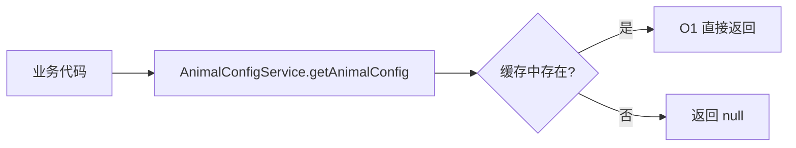
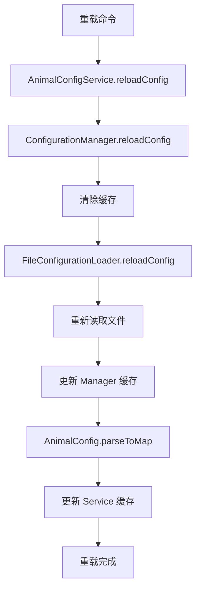

# RookiePlague 通用配置管理架构设计

## 📋 概述

本项目采用分层架构设计的通用配置管理系统，支持灵活的配置加载、缓存管理和业务数据解析。该架构专为 **动物瘟疫系统** 设计，同时具备良好的扩展性，可以轻松适配其他类型的配置需求。

## 🏗️ 架构设计

### 整体架构图

```
┌─────────────────────────────────────────────┐
│        业务服务层 (Service)                  │
│  - AnimalConfigService: 动物配置业务逻辑     │
├─────────────────────────────────────────────┤
│        配置管理层 (Config)                   │
│  - ConfigurationManager: 配置缓存与管理      │
├─────────────────────────────────────────────┤
│        SPI 接口层 (config.spi)               │
│  - ConfigurationLoader: 配置加载接口         │
├─────────────────────────────────────────────┤
│        实现层 (config.impl)                  │
│  - FileConfigurationLoader: 文件加载实现     │
├─────────────────────────────────────────────┤
│        数据模型层 (Model)                    │
│  - AnimalConfig: 动物配置数据模型            │
└─────────────────────────────────────────────┘
```

### 架构特点

- **分层清晰**：各层职责明确，便于维护和扩展
- **接口驱动**：基于 SPI 设计，支持多种实现方式
- **缓存机制**：避免重复 I/O，提升性能
- **类型安全**：强类型数据模型，避免配置解析错误
- **线程安全**：使用 ConcurrentHashMap 保证并发安全

## 📦 包结构

```
com.cuzz.rookiePlague
├── RookiePlague.java                   // 主类，插件入口
├── config/                             // 配置管理包
│   ├── ConfigurationManager.java      // 配置管理器（缓存+统一访问）
│   ├── spi/                           // SPI 接口包
│   │   └── ConfigurationLoader.java   // 配置加载器接口
│   └── impl/                          // 实现包
│       └── FileConfigurationLoader.java // 文件配置加载器实现
├── model/                             // 业务领域模型包
│   └── AnimalConfig.java             // 动物配置数据模型
└── service/                           // 业务服务包
    └── AnimalConfigService.java      // 动物配置服务
```

## 🔧 核心组件

### 1. ConfigurationLoader (SPI 接口)

**职责**：定义配置加载的标准行为

**接口定义**：
```java
public interface ConfigurationLoader {
    YamlConfiguration loadConfig(String name);
    YamlConfiguration reloadConfig(String name);
    boolean exists(String name);
}
```

**特点**：
- ✅ 支持多种实现方式（文件、云端、数据库等）
- ✅ 遵循 SPI 设计模式
- ✅ 便于扩展和测试

### 2. FileConfigurationLoader (实现类)

**职责**：从本地文件系统加载 YAML 配置

**核心功能**：
- ✅ 自动从插件资源复制默认配置
- ✅ 支持列表格式的 YAML 文件（如 animal.yml）
- ✅ 处理配置文件不存在的情况
- ✅ 加载默认配置作为 fallback

**关键实现**：
```java
// 使用 SnakeYAML 检测数据类型
Object data = yaml.load(fis);
if (data instanceof List) {
    // 列表格式包装处理
    String rootKey = getRootKeyFromFileName(name); // "animal.yml" -> "animals"
    config.set(rootKey, data);
} else {
    // 普通 Map 格式正常加载
    config = YamlConfiguration.loadConfiguration(configFile);
}
```

### 3. ConfigurationManager (管理器)

**职责**：提供统一的配置访问接口和缓存管理

**核心功能**：
- ✅ 配置缓存（避免重复加载）
- ✅ 配置热重载
- ✅ 统一访问入口
- ✅ 线程安全（ConcurrentHashMap）
- ✅ 批量重载支持

**API 示例**：
```java
ConfigurationManager manager = new ConfigurationManager(loader);

// 获取配置（自动缓存）
YamlConfiguration config = manager.getConfig("animal.yml");

// 重载配置（清除缓存并重新加载）
YamlConfiguration reloaded = manager.reloadConfig("animal.yml");

// 重载所有配置
manager.reloadAll();

// 清空缓存
manager.clearCache();
```

### 4. AnimalConfig (数据模型)

**职责**：动物配置的数据模型和解析逻辑

**字段说明**：

| 字段名 | 类型 | 说明 | 默认值 |
|--------|------|------|--------|
| `type` | String | 动物类型（唯一标识，如 SHEEP、CHICKEN） | - |
| `desc` | String | 动物描述（中文名称） | - |
| `speciesFactor` | double | 物种因子（影响染疫概率） | 1.0 |
| `chunkLimit` | int | 区块上限（单区块内数量上限） | 10 |
| `corpseDropRate` | int | 尸体掉落概率（百分比） | 50 |
| `corpseMobid` | String | 尸体模型ID（CE模型） | - |
| `maxBreedTimes` | int | 最大繁殖次数 | 5 |
| `plagueDeathTime` | int | 瘟疫致死时间（秒） | 300 |

**解析方法**：

1. **列表解析**：
```java
List<AnimalConfig> animals = AnimalConfig.parseFromConfig(config);
```

2. **Map 解析**（推荐，高效）：
```java
Map<String, AnimalConfig> animalMap = AnimalConfig.parseToMap(config);
AnimalConfig sheep = animalMap.get("SHEEP"); // O(1) 查找
```

**特点**：
- ✅ 类型安全转换（int、double、String）
- ✅ 支持默认值
- ✅ 双模式解析（List/Map）
- ✅ 自动处理 YAML 列表格式
- ✅ 容错机制（解析失败不中断）

### 5. AnimalConfigService (业务服务)

**职责**：管理动物配置的业务逻辑

**核心功能**：

| 功能 | 方法 | 说明 |
|------|------|------|
| 加载配置 | `loadConfig()` | 从配置文件加载动物配置 |
| 重载配置 | `reloadConfig()` | 热重载配置 |
| 查询配置 | `getAnimalConfig(String type)` | 根据类型查询配置（O(1)） |
| 获取所有配置 | `getAllAnimals()` | 获取所有动物配置 |
| 获取类型列表 | `getAllAnimalTypes()` | 获取所有动物类型 |
| 存在性检查 | `exists(String type)` | 检查配置是否存在 |
| 获取数量 | `getAnimalCount()` | 获取配置数量 |

**高级查询功能**：

```java
// 根据物种因子范围查询
List<AnimalConfig> highRisk = service.getAnimalsBySpeciesFactor(1.2, 2.0);

// 根据区块上限查询
List<AnimalConfig> limited = service.getAnimalsByChunkLimit(15, 20);

// 根据尸体模型查询
List<AnimalConfig> largeCorpse = service.getAnimalsByCorpseMobid("animal_corpse_large");
```

## 📄 配置文件

### animal.yml - 动物配置

```yaml
- type: 'SHEEP'
  desc: '羊'
  speciesFactor: 0.9
  chunkLimit: 18
  corpseDropRate: 70
  corpseMobid: 'animal_corpse_large'
  maxBreedTimes: 5
  plagueDeathTime: 320

- type: 'CHICKEN'
  desc: '鸡'
  speciesFactor: 1.3
  chunkLimit: 20
  corpseDropRate: 60
  corpseMobid: 'animal_corpse_small'
  maxBreedTimes: 8
  plagueDeathTime: 240
```

**注意事项**：
- ✅ 使用 YAML 列表格式（以 `-` 开头）
- ✅ 加载后自动转换为 `Map<String, AnimalConfig>`
- ✅ 以 `type` 字段作为 Map 的 key
- ✅ 支持动态添加新的动物类型

## 🔄 数据流程

### 配置加载流程

```mermaid
graph TB
    A[插件启动] --> B[创建 FileConfigurationLoader]
    B --> C[创建 ConfigurationManager]
    C --> D[创建 AnimalConfigService]
    D --> E[调用 loadConfig]
    E --> F[ConfigurationManager.getConfig]
    F --> G[FileConfigurationLoader.loadConfig]
    G --> H{文件存在?}
    H -->|否| I[从资源复制默认配置]
    H -->|是| J[读取配置文件]
    I --> J
    J --> K[检测文件格式]
    K --> L{是列表格式?}
    L -->|是| M[包装为 animals: [list]]
    L -->|否| N[直接加载]
    M --> O[返回 YamlConfiguration]
    N --> O
    O --> P[缓存配置]
    P --> Q[AnimalConfig.parseToMap]
    Q --> R[转换为 Map]
    R --> S[缓存到 Service]
    S --> T[加载完成]
```

### 配置查询流程



### 配置重载流程



## 🎯 设计优势

### 1. 清晰的职责分离

| 组件 | 职责 |
|------|------|
| ConfigurationLoader | 只负责加载原始配置 |
| ConfigurationManager | 只负责缓存和管理 |
| AnimalConfig | 只负责数据解析和转换 |
| AnimalConfigService | 只负责业务逻辑 |

### 2. 高扩展性
- ✅ SPI 接口设计，可轻松添加新的加载方式
- ✅ 配置解析逻辑在模型层，独立于加载逻辑
- ✅ 服务层可以引用其他服务，支持复杂业务
- ✅ 新增动物类型只需修改配置文件

### 3. 高性能
- ✅ 配置缓存机制（ConfigurationManager）
- ✅ Map 结构提供 O(1) 查找效率
- ✅ 避免重复文件 I/O
- ✅ 线程安全的并发访问

### 4. 易维护
- ✅ 包结构清晰
- ✅ 各组件职责明确
- ✅ 代码复用性高
- ✅ 单元测试友好

## 🚀 使用示例

### 在主类中初始化

```java
public class RookiePlague extends JavaPlugin {
    private ConfigurationManager configManager;
    private AnimalConfigService animalConfigService;
    
    @Override
    public void onEnable() {
        // 初始化配置管理器
        ConfigurationLoader loader = new FileConfigurationLoader(this);
        configManager = new ConfigurationManager(loader);
        
        // 初始化动物配置服务
        animalConfigService = new AnimalConfigService(configManager);
        
        // 加载配置
        if (animalConfigService.loadConfig()) {
            getLogger().info("成功加载 " + animalConfigService.getAnimalCount() + " 个动物配置");
            
            // 输出配置信息
            animalConfigService.getAllAnimals().forEach(config -> {
                getLogger().info(String.format("- %s(%s): 物种因子=%.2f, 区块上限=%d",
                        config.getDesc(), config.getType(),
                        config.getSpeciesFactor(), config.getChunkLimit()));
            });
        } else {
            getLogger().warning("加载动物配置失败");
        }
    }
    
    public AnimalConfigService getAnimalConfigService() {
        return animalConfigService;
    }
}
```

### 在业务逻辑中使用

```java
// 获取服务
AnimalConfigService service = plugin.getAnimalConfigService();

// 查询单个配置
AnimalConfig sheep = service.getAnimalConfig("SHEEP");
if (sheep != null) {
    double factor = sheep.getSpeciesFactor();
    int chunkLimit = sheep.getChunkLimit();
    int deathTime = sheep.getPlagueDeathTime();
    
    getLogger().info(String.format("%s 的染疫概率系数为 %.2f", sheep.getDesc(), factor));
}

// 遍历所有配置
for (AnimalConfig config : service.getAllAnimals()) {
    getLogger().info(config.getDesc() + " - " + config.getType());
}

// 查询高危动物（物种因子 > 1.0）
List<AnimalConfig> highRisk = service.getAnimalsBySpeciesFactor(1.0, 2.0);
highRisk.forEach(config -> {
    getLogger().warning("高危动物: " + config.getDesc());
});

// 重载配置
if (service.reloadConfig()) {
    getLogger().info("配置重载成功");
}
```

### 在监听器中使用

```java
public class AnimalBreedListener implements Listener {
    private final AnimalConfigService configService;
    
    public AnimalBreedListener(AnimalConfigService configService) {
        this.configService = configService;
    }
    
    @EventHandler
    public void onAnimalBreed(EntityBreedEvent event) {
        if (!(event.getEntity() instanceof Animals animal)) {
            return;
        }
        
        String type = animal.getType().name();
        AnimalConfig config = configService.getAnimalConfig(type);
        
        if (config != null) {
            // 检查繁殖次数限制
            int currentBreeds = getBreedCount(animal);
            if (currentBreeds >= config.getMaxBreedTimes()) {
                event.setCancelled(true);
                // 通知玩家
            }
        }
    }
}
```

## 📝 扩展指南

### 添加新的配置加载方式

**示例：从数据库加载配置**

```java
public class DatabaseConfigurationLoader implements ConfigurationLoader {
    private final DataSource dataSource;
    
    public DatabaseConfigurationLoader(DataSource dataSource) {
        this.dataSource = dataSource;
    }
    
    @Override
    public YamlConfiguration loadConfig(String name) {
        try (Connection conn = dataSource.getConnection()) {
            // 从数据库查询配置
            String sql = "SELECT config_data FROM configs WHERE name = ?";
            PreparedStatement stmt = conn.prepareStatement(sql);
            stmt.setString(1, name);
            ResultSet rs = stmt.executeQuery();
            
            if (rs.next()) {
                String yamlData = rs.getString("config_data");
                return YamlConfiguration.loadConfiguration(
                    new StringReader(yamlData)
                );
            }
        } catch (SQLException e) {
            e.printStackTrace();
        }
        return new YamlConfiguration();
    }
    
    @Override
    public YamlConfiguration reloadConfig(String name) {
        return loadConfig(name);
    }
    
    @Override
    public boolean exists(String name) {
        // 检查数据库中是否存在
        return false;
    }
}
```

**使用方式**：
```java
ConfigurationLoader loader = new DatabaseConfigurationLoader(dataSource);
ConfigurationManager manager = new ConfigurationManager(loader);
```

### 添加新的业务模型

**示例：添加药物配置**

1. **创建数据模型**：
```java
package com.cuzz.rookiePlague.model;

public class MedicineConfig {
    private String id;
    private String name;
    private int cureRate;
    private int price;
    
    // Getter/Setter...
    
    public static Map<String, MedicineConfig> parseToMap(YamlConfiguration config) {
        // 解析逻辑
    }
}
```

2. **创建服务类**：
```java
package com.cuzz.rookiePlague.service;

public class MedicineConfigService {
    private final ConfigurationManager configManager;
    private Map<String, MedicineConfig> medicineMap;
    
    public MedicineConfigService(ConfigurationManager configManager) {
        this.configManager = configManager;
    }
    
    public boolean loadConfig() {
        YamlConfiguration config = configManager.getConfig("medicine.yml");
        this.medicineMap = MedicineConfig.parseToMap(config);
        return true;
    }
    
    public MedicineConfig getMedicine(String id) {
        return medicineMap.get(id);
    }
}
```

3. **在主类中注册**：
```java
private MedicineConfigService medicineService;

@Override
public void onEnable() {
    // ... 初始化配置管理器
    
    medicineService = new MedicineConfigService(configManager);
    medicineService.loadConfig();
}
```

### 添加配置验证

```java
public class AnimalConfigService {
    
    public boolean loadConfig() {
        try {
            YamlConfiguration config = configManager.getConfig(CONFIG_FILE);
            this.animalConfigMap = AnimalConfig.parseToMap(config);
            
            // 配置验证
            validateConfigs();
            
            return true;
        } catch (Exception e) {
            e.printStackTrace();
            return false;
        }
    }
    
    private void validateConfigs() {
        for (AnimalConfig config : animalConfigMap.values()) {
            // 验证物种因子范围
            if (config.getSpeciesFactor() < 0.1 || config.getSpeciesFactor() > 2.0) {
                throw new IllegalArgumentException(
                    config.getType() + " 的物种因子超出范围 [0.1, 2.0]"
                );
            }
            
            // 验证区块上限
            if (config.getChunkLimit() <= 0) {
                throw new IllegalArgumentException(
                    config.getType() + " 的区块上限必须大于 0"
                );
            }
            
            // 验证尸体掉落概率
            if (config.getCorpseDropRate() < 0 || config.getCorpseDropRate() > 100) {
                throw new IllegalArgumentException(
                    config.getType() + " 的尸体掉落概率必须在 [0, 100] 范围内"
                );
            }
        }
    }
}
```

## 🔍 故障排查

### 常见问题

| 问题 | 原因 | 解决方案 |
|------|------|----------|
| 配置加载失败 | 文件不存在或格式错误 | 检查 resources 目录和 YAML 语法 |
| 解析返回空列表 | 根键名不匹配 | 确认使用 "animals" 或 "animal" |
| 热重载不生效 | 未调用 reloadConfig | 确保正确调用服务的重载方法 |
| 配置值为默认值 | 字段名拼写错误 | 检查 YAML 字段名与模型字段一致 |
| 性能下降 | 频繁重载配置 | 使用缓存，避免不必要的重载 |

### 调试技巧

```java
// 开启调试日志
public class AnimalConfigService {
    private static final boolean DEBUG = true;
    
    public AnimalConfig getAnimalConfig(String type) {
        AnimalConfig config = animalConfigMap.get(type);
        
        if (DEBUG) {
            if (config == null) {
                plugin.getLogger().warning("配置不存在: " + type);
                plugin.getLogger().warning("可用配置: " + animalConfigMap.keySet());
            } else {
                plugin.getLogger().info("找到配置: " + config);
            }
        }
        
        return config;
    }
}
```

## 📊 性能优化

### 优化措施

| 优化项 | 实现方式 | 效果 |
|--------|----------|------|
| 配置缓存 | ConfigurationManager 内存缓存 | 避免重复 I/O |
| Map 查询 | 使用 LinkedHashMap 存储 | O(1) 查找效率 |
| 延迟加载 | 首次访问时才加载 | 减少启动时间 |
| 线程安全 | ConcurrentHashMap | 支持并发访问 |
| 批量操作 | reloadAll() 方法 | 减少方法调用 |

### 性能测试

```java
// 测试配置查询性能
long start = System.nanoTime();
for (int i = 0; i < 10000; i++) {
    service.getAnimalConfig("SHEEP");
}
long end = System.nanoTime();
getLogger().info("10000 次查询耗时: " + (end - start) / 1000000.0 + "ms");
```

## 🎓 最佳实践

### 1. 配置文件分离
```
resources/
├── animal.yml      # 动物配置
├── medicine.yml    # 药物配置
├── plague.yml      # 瘟疫配置
└── config.yml      # 主配置
```

### 2. 服务层优先
```java
// ❌ 不推荐：直接访问配置管理器
YamlConfiguration config = configManager.getConfig("animal.yml");
Map<String, Object> data = config.getConfigurationSection("animals").getValues(false);

// ✅ 推荐：通过服务层访问
AnimalConfig sheep = animalConfigService.getAnimalConfig("SHEEP");
```

### 3. 缓存优先
```java
// ❌ 不推荐：每次都从文件读取
YamlConfiguration config = configManager.reloadConfig("animal.yml");

// ✅ 推荐：使用缓存
YamlConfiguration config = configManager.getConfig("animal.yml");
```

### 4. 类型安全
```java
// ❌ 不推荐：直接操作 YAML
double factor = config.getDouble("animals.SHEEP.speciesFactor");

// ✅ 推荐：使用强类型模型
AnimalConfig sheep = service.getAnimalConfig("SHEEP");
double factor = sheep.getSpeciesFactor();
```

### 5. 错误处理
```java
// ✅ 推荐：适当处理空值
AnimalConfig config = service.getAnimalConfig(type);
if (config == null) {
    getLogger().warning("未找到动物配置: " + type);
    return;
}

// 使用配置
int limit = config.getChunkLimit();
```

## 🔄 与原架构的差异

### 主要变更

| 项目 | 原架构 (MonsterController) | 新架构 (RookiePlague) |
|------|---------------------------|----------------------|
| 数据模型 | MonsterConfig | AnimalConfig |
| 业务服务 | MonsterService | AnimalConfigService |
| 配置文件 | monsters.yml | animal.yml |
| 核心字段 | id, type, rangeChunk, restrainRate, spawnRate, dropMulti, shinyMob | type, desc, speciesFactor, chunkLimit, corpseDropRate, corpseMobid, maxBreedTimes, plagueDeathTime |

### 保留内容

- ✅ SPI 接口设计 (ConfigurationLoader)
- ✅ 文件加载实现 (FileConfigurationLoader)
- ✅ 配置管理器 (ConfigurationManager)
- ✅ 列表格式 YAML 支持
- ✅ Map 结构缓存
- ✅ 热重载机制

### 改进内容

- ✅ 更丰富的动物属性字段
- ✅ 更强的类型安全保证
- ✅ 更完善的查询API
- ✅ 更详细的日志输出
- ✅ 更好的错误处理

## 📚 总结

本通用配置管理架构具备以下核心优势：

1. **通用性强**：可快速适配不同类型的配置需求
2. **扩展性好**：SPI 设计支持多种加载方式
3. **性能优异**：缓存机制 + O(1) 查询
4. **易于维护**：清晰的分层架构和职责划分
5. **类型安全**：强类型模型避免配置错误
6. **线程安全**：支持并发访问场景

通过本架构，您可以轻松管理 RookiePlague 插件的动物配置，同时也可以快速扩展到其他配置场景，如药物配置、瘟疫配置等。
