# MonsterController 配置管理架构设计

## 📋 概述

本项目采用分层架构设计的配置管理系统，支持灵活的配置加载、缓存管理和业务数据解析。

## 🏗️ 架构设计

### 整体架构图

详细类图参见：`MonsterController/uml/配置管理器类图.puml`

### 分层说明

```
┌─────────────────────────────────────────────┐
│           业务服务层 (Service)               │
│  - MonsterConfService: 怪物配置业务逻辑          │
├─────────────────────────────────────────────┤
│         配置管理层 (Config)                  │
│  - ConfigurationManager: 配置缓存与管理      │
├─────────────────────────────────────────────┤
│         SPI 接口层 (config.spi)              │
│  - ConfigurationLoader: 配置加载接口         │
├─────────────────────────────────────────────┤
│         实现层 (config.impl)                 │
│  - FileConfigurationLoader: 文件加载实现     │
├─────────────────────────────────────────────┤
│         数据模型层 (Model)                   │
│  - MonsterConfig: 怪物配置数据模型           │
└─────────────────────────────────────────────┘
```

## 📦 包结构

```
com.cuzz.monsterController
├── MonsterController.java          // 主类，插件入口
├── config/                          // 配置管理包
│   ├── ConfigurationManager.java   // 配置管理器（缓存+统一访问）
│   ├── spi/                        // SPI 接口包
│   │   └── ConfigurationLoader.java // 配置加载器接口
│   └── impl/                       // 实现包
│       └── FileConfigurationLoader.java // 文件配置加载器实现
├── model/                          // 业务领域模型包
│   └── MonsterConfig.java         // 怪物配置数据模型
└── service/                        // 业务服务包
    └── MonsterService.java        // 怪物配置服务
```

## 🔧 核心组件

### 1. ConfigurationLoader (SPI 接口)

**职责**：定义配置加载的标准行为

```java
public interface ConfigurationLoader {
    YamlConfiguration loadConfig(String name);
    YamlConfiguration reloadConfig(String name);
    boolean exists(String name);
}
```

**特点**：
- 支持多种实现方式（文件、云端、数据库等）
- 遵循 SPI 设计模式
- 便于扩展和测试

### 2. FileConfigurationLoader (实现类)

**职责**：从本地文件系统加载 YAML 配置

**实现特点**：
- 自动从插件资源复制默认配置
- 支持列表格式的 YAML 文件（如 monsters.yml）
- 处理配置文件不存在的情况
- 加载默认配置作为 fallback

**关键实现**：
```java
// 使用 SnakeYAML 检测数据类型
Object data = yaml.load(fis);
if (data instanceof List) {
    // 列表格式包装处理
    config.set("monsters", data);
} else {
    // 普通 Map 格式正常加载
    config = YamlConfiguration.loadConfiguration(configFile);
}
```

### 3. ConfigurationManager (管理器)

**职责**：提供统一的配置访问接口和缓存管理

**功能**：
- ✅ 配置缓存（避免重复加载）
- ✅ 配置热重载
- ✅ 统一访问入口
- ✅ 配置存在性检查

**使用示例**：
```java
ConfigurationManager manager = new ConfigurationManager(loader);
YamlConfiguration config = manager.getConfig("monsters.yml");
YamlConfiguration reloaded = manager.reloadConfig("monsters.yml");
```

### 4. MonsterConfig (数据模型)

**职责**：怪物配置的数据模型和解析逻辑

**字段**：
- `id`: 怪物ID
- `type`: 怪物类型（用作唯一标识）
- `desc`: 怪物描述
- `rangeChunk`: 刷新范围（区块）
- `restrainRate`: 限制比率
- `spawnRate`: 刷新频率
- `dropMulti`: 掉落倍率
- `shinyMob`: 闪光怪物ID

**解析方法**：

1. **列表解析**：
```java
List<MonsterConfig> monsters = MonsterConfig.parseFromConfig(config);
```

2. **Map 解析**（推荐，高效）：
```java
Map<String, MonsterConfig> monsterMap = MonsterConfig.parseToMap(config);
MonsterConfig zombie = monsterMap.get("ZOMBIE"); // O(1) 查找
```

**特点**：
- 类型安全转换（int、double、String）
- 支持默认值
- 双模式解析（List/Map）
- 自动处理 YAML 列表格式

### 5. MonsterService (业务服务)

**职责**：管理怪物配置的业务逻辑

**功能**：
- ✅ 加载怪物配置
- ✅ 重载配置
- ✅ 根据类型查询配置
- ✅ 获取所有配置
- ✅ 配置存在性检查
- ✅ 获取配置数量

**使用示例**：
```java
MonsterService service = new MonsterService(configManager);
service.loadConfig();

// 查询配置
MonsterConfig config = service.getMonsterConfig("ZOMBIE");

// 重载配置
service.reloadConfig();
```

## 📄 配置文件

### config.yml - 全局配置

```yaml
messages:
  onEnable: "Monster Controller has been enabled!"
  onDisable: "Monster Controller has been disabled!"
```

### monsters.yml - 怪物配置

```yaml
- id: 1
  type: 'ZOMBIE'
  desc: '僵尸'
  rangeChunk: 3
  restrainRate: 30
  spawnRate: 3
  dropMulti: 3
  shinyMob: 'shiny_zombie'
- id: 2
  type: 'SKELETON'
  desc: '骷髅'
  rangeChunk: 3
  restrainRate: 25
  spawnRate: 3
  dropMulti: 2.5
  shinyMob: 'shiny_skeleton'
# ... 更多怪物配置
```

**注意**：
- monsters.yml 是列表格式
- 加载后会自动转换为 `Map<String, MonsterConfig>`
- 以 `type` 字段作为 Map 的 key

## 🔄 数据流程

### 配置加载流程

```mermaid
graph LR
    A[插件启动] --> B[创建 FileConfigurationLoader]
    B --> C[创建 ConfigurationManager]
    C --> D[创建 MonsterService]
    D --> E[加载 monsters.yml]
    E --> F[FileConfigurationLoader 读取文件]
    F --> G[检测为列表格式]
    G --> H[包装为 monsters: []]
    H --> I[返回 YamlConfiguration]
    I --> J[MonsterConfig.parseToMap]
    J --> K[转换为 Map<String, MonsterConfig>]
    K --> L[缓存到 MonsterService]
```

### 配置查询流程

```mermaid
graph LR
    A[业务代码] --> B[MonsterService.getMonsterConfig]
    B --> C{缓存中存在?}
    C -->|是| D[直接返回]
    C -->|否| E[返回 null]
```



### 配置重载流程

```mermaid
graph LR
    A[重载命令] --> B[MonsterService.reloadConfig]
    B --> C[ConfigurationManager.reloadConfig]
    C --> D[FileConfigurationLoader.reloadConfig]
    D --> E[重新读取文件]
    E --> F[更新缓存]
    F --> G[MonsterConfig.parseToMap]
    G --> H[更新 Service 缓存]
```



## 🎯 设计优势

### 1. 清晰的职责分离
- **ConfigurationLoader**：只负责加载原始配置
- **ConfigurationManager**：只负责缓存和管理
- **MonsterConfig**：只负责数据解析和转换
- **MonsterService**：只负责业务逻辑

### 2. 高扩展性
- SPI 接口设计，可轻松添加新的加载方式
- 配置解析逻辑在模型层，独立于加载逻辑
- 服务层可以引用其他服务，支持复杂业务

### 3. 高性能
- 配置缓存机制
- Map 结构提供 O(1) 查找效率
- 避免重复文件 I/O

### 4. 易维护
- 包结构清晰
- 各组件职责明确
- 代码复用性高

## 🚀 使用示例

### 在主类中初始化

```java
public class MonsterController extends JavaPlugin {
    private ConfigurationManager configManager;
    private MonsterService monsterService;
    
    @Override
    public void onEnable() {
        // 初始化配置管理器
        FileConfigurationLoader loader = new FileConfigurationLoader(this);
        configManager = new ConfigurationManager(loader);
        
        // 加载主配置
        YamlConfiguration config = configManager.getConfig("config.yml");
        String message = config.getString("messages.onEnable");
        getLogger().info(message);
        
        // 初始化怪物服务
        monsterService = new MonsterService(configManager);
        monsterService.loadConfig();
        getLogger().info("加载了 " + monsterService.getMonsterCount() + " 个怪物配置");
    }
    
    public MonsterService getMonsterService() {
        return monsterService;
    }
}
```

### 在其他地方使用

```java
// 获取服务
MonsterService service = plugin.getMonsterService();

// 查询配置
MonsterConfig zombie = service.getMonsterConfig("ZOMBIE");
if (zombie != null) {
    int spawnRate = zombie.getSpawnRate();
    double dropMulti = zombie.getDropMulti();
    // ... 使用配置
}

// 遍历所有配置
for (MonsterConfig config : service.getAllMonsters()) {
    getLogger().info(config.getDesc());
}

// 重载配置
service.reloadConfig();
```

## 📝 扩展指南

### 添加新的配置加载方式

1. 实现 `ConfigurationLoader` 接口：

```java
public class DatabaseConfigurationLoader implements ConfigurationLoader {
    @Override
    public YamlConfiguration loadConfig(String name) {
        // 从数据库加载配置
    }
    
    @Override
    public YamlConfiguration reloadConfig(String name) {
        // 重新从数据库加载
    }
    
    @Override
    public boolean exists(String name) {
        // 检查配置是否存在
    }
}
```

2. 在主类中使用：

```java
ConfigurationLoader loader = new DatabaseConfigurationLoader();
ConfigurationManager manager = new ConfigurationManager(loader);
```

### 添加新的业务模型

1. 在 `model` 包中创建新模型：

```java
package com.cuzz.monsterController.model;

public class ItemConfig {
    // 道具配置字段和解析逻辑
}
```

2. 创建对应的服务：

```java
package com.cuzz.monsterController.service;

public class ItemService {
    private final ConfigurationManager configManager;
    // 业务逻辑
}
```

## 🔍 故障排查

### 常见问题

1. **配置加载失败**
   - 检查配置文件是否存在于 `resources` 目录
   - 检查 YAML 格式是否正确
   - 查看控制台错误日志

2. **解析返回空列表**
   - 确认配置文件格式正确
   - 检查 `monsters` 键名是否匹配
   - 验证数据类型转换逻辑

3. **热重载不生效**
   - 确认调用了 `reloadConfig()` 方法
   - 检查缓存是否正确更新
   - 验证服务是否重新加载了配置

## 📊 性能优化

- ✅ 配置缓存避免重复 I/O
- ✅ Map 结构提供 O(1) 查找
- ✅ 延迟加载配置文件
- ✅ 避免不必要的配置重载

## 🎓 最佳实践

1. **配置文件分离**：将不同类型的配置分到不同文件
2. **使用服务层**：业务逻辑通过 Service 访问配置
3. **缓存优先**：优先使用 Service 的缓存，避免频繁访问 Manager
4. **类型安全**：使用强类型模型而不是直接操作 YAML
5. **错误处理**：适当处理配置不存在或格式错误的情况